<a href="https://redocu.github.io"></a>

<p align="center">
  <a href="https://redocu.github.io"></a>
  <a href="https://redocu.github.io/projects/"></a>
  <a href="https://redocu.github.io/wiki/"></a>
  <a href="https://redocu.github.io/apps/"></a>
  <a href="https://redocu.github.io/#contact"></a>
</p>

<p align="center">
  
  
  
  
  
  
  
  
  
  
  
</p>

```text
// PROFILE.MODULE
NAME      DOCU
ROLE      AX DEVELOPER — 게임 클라이언트 → 비전 AI → 웹 서비스
FOCUS     Claude Code 중심 개발 도구 · 웹 게임 · 학습 문서
DEPLOYED  EQMUX v0.3.0 · SPM
BUILDING  CharacterChat · Arknights Clone
WIKI      6 COURSES · 607 DOCS
```

> 🔒 = 비공개 저장소. 공개된 소개 페이지·배포 사이트가 있으면 그쪽으로 링크했습니다.

---

## 배포 중 <sub>// SECTION 01 — DEPLOYED</sub>

| 프로젝트 | 상태 | 설명 | 링크 |
| --- | :-: | --- | --- |
| **EQMUX** | <a href="https://github.com/ReDocu/EQMUX/releases/latest"></a> | 하나의 git 저장소를 AI 에이전트 팀이 함께 작업하고 사람이 관제하는 Windows 데스크톱 앱.<br><sub>`Tauri 2` `Rust` `SolidJS`</sub> | [다운로드](https://github.com/ReDocu/EQMUX/releases/latest) · [소개 사이트](https://eqmux-web-site.vercel.app/ko/) · [상세](https://redocu.github.io/projects/eqmux/) · [Repo](https://github.com/ReDocu/EQMUX) |
| **SPM** 🔒 |  | 1인 개발 스튜디오의 프로젝트·외주·배포·장부·지식을 한 화면에서 관리하는 업무 앱.<br><sub>`React 19` `Cloudflare Workers` `D1 · R2`</sub> | [소개](https://redocu.github.io/personal-assistant/) · [체험판](https://redocu.github.io/personal-assistant/demo/) · [기술문서](https://redocu.github.io/personal-assistant/tech/) |

## 작업 중 <sub>// SECTION 02 — IN PROGRESS</sub>

```diff
! CharacterChat     DEV   캐릭터와 대화하는 웹앱 — Python CLI(Ollama) 버전에서 웹으로 이전 중
! Arknights Clone   DEV   명일방주 역기획 — 게임데이터 CSV 68종·약 37만 행 정규화, 설계 의도 역산
```

<sub>두 프로젝트 모두 🔒 비공개입니다.</sub>

## 포트폴리오 <sub>// SECTION 03 — PORTFOLIO</sub>

| 프로젝트 | 상태 | 설명 | 링크 |
| --- | :-: | --- | --- |
| **CSGP** |  | Win32 API 기반 C++ 콘솔 게임 프레임워크. 엔진·콘텐츠 분리 구조 위에서 콘솔 게임 9종을 만들며 C·C++을 익히는 학습용 프로젝트.<br><sub>`C++` `Win32 API` `교육`</sub> | [다운로드](https://github.com/ReDocu/CSGPProject/releases/tag/v1.0) · [학습문서](https://redocu.github.io/projects/csgp/study-doc/index.html) · [상세](https://redocu.github.io/projects/csgp/) · [Repo](https://github.com/ReDocu/CSGPProject) |
| **가상 이력서 시뮬레이션** |  | 이력서를 등록하면 128명 캐릭터 코퍼스와의 성향 근접도를 계산해 개인 분석과 팀 배치 시뮬레이션을 보여 주는 데스크톱 앱.<br><sub>`Vanilla JS` `Python` `오프라인`</sub> | [다운로드](https://github.com/ReDocu/ResumeAnalyze/releases/tag/v0.1) · [기술문서](https://redocu.github.io/projects/resume-sim/tech-doc.html) · [상세](https://redocu.github.io/projects/resume-sim/) · [Repo](https://github.com/ReDocu/ResumeAnalyze) |
| **AssassinAction** 🔒 |  | 액션 게임 포트폴리오. 준비 중입니다. | — |

## EQMent <sub>// SECTION 04 — ORGANIZATION</sub>

교육 서비스와 게임을 조직 단위로 나눠 만들고 있습니다. 저장소는 모두 🔒 비공개입니다.

**[EQMent-Academy](https://github.com/EQMent-Academy)** — 교육

| 프로젝트 | 상태 | 설명 | 링크 |
| --- | :-: | --- | --- |
| **EduCraft** |  | 책 제작(BookCraft)·학습 관리(LMSCraft)·강의 탐색(LecView)·미니게임 네 공방을 하나로 묶은 학습 플랫폼. v1 개발 중. | [사이트](http://www.eqment.store/) |
| **AgentWikiDoc** |  | 고정된 말투와 인격을 가진 AI 작가들이 교재·기술서를 집필하고, 위키처럼 읽는 정적 퍼블리싱 사이트. | [사이트](https://agent-wiki-doc.vercel.app) |
| **WordDoc Community** |  | 국어사전 단어를 사람들이 실제로 쓰는 뜻으로 공유·재정의하는 커뮤니티. 기획 → 문서 → 개발 에이전트 파이프라인으로 제작. | — |

**[EQMent-Studio](https://github.com/EQMent-Studio)** — 게임

```diff
! Tennis Simulator     DEV   실제 규칙과 선수 능력치 기반 테니스 시뮬레이션 — GDD 작성 중
! MobilePuzzle         DEV   광고 없는 모바일 퍼즐 — 웹 · iOS · Android 출시 준비
! DUORBIT              DEV   한 곡을 오빗 · 폴 · 스위치 세 방식으로 플레이하는 웹 리듬 게임
! AnimalDefence        DEV   4개 관문과 왕성을 하나의 전장으로 잇는 거점 배치 타워디펜스
! Roguelike Framework  PREP  로그라이크 게임 프레임워크 — 준비 중
```

## 학습 위키 <sub>// SECTION 05 — KNOWLEDGE BASE</sub>

직접 설계한 커리큘럼을 하루 단위 위키형 학습 문서로 정리해 배포합니다.

| # | 과정 | DOCS | |
| :-: | --- | --: | --- |
| 01 | **[24주] C에서 Unity까지** — 게임 개발 120일 | 125 | [▶ 커리큘럼](https://redocu.github.io/wiki/game-to-unity/curriculum/) |
| 02 | **[36주] 데이터에서 Object Detection** — Python·YOLO 180일 | 191 | [▶ 커리큘럼](https://redocu.github.io/wiki/data-to-vision/curriculum/) |
| 03 | **[15주] Git 혼자서, 팀으로, 자동화까지** — 30강 | 35 | [▶ 커리큘럼](https://redocu.github.io/wiki/git/curriculum/) |
| 04 | **[32주] MLOps 엔지니어 양성과정** — 160일 | 174 | [▶ 커리큘럼](https://redocu.github.io/wiki/mlops/curriculum/) |
| 05 | **[16주] AWS 인프라부터 서버리스까지** — 32강 | 44 | [▶ 커리큘럼](https://redocu.github.io/wiki/aws/curriculum/) |
| 06 | **[8주] 정보처리기사 실기 완성** — 16강 | 38 | [▶ 커리큘럼](https://redocu.github.io/wiki/info-engineer/curriculum/) |

<sub>전체 과정 → <a href="https://redocu.github.io/wiki/">학습 위키 홈</a> · 브라우저에서 바로 실행되는 <a href="https://redocu.github.io/apps/puzzle-lab/">퍼즐 랩(스도쿠·가쿠로)</a></sub>

## 교육 <sub>// SECTION 06 — ACADEMY</sub>

| 기간 | 과정 | |
| --- | --- | --- |
| 2019.09 – 2020.03 | **디벨로퍼로켓** (전 경일게임아카데미) — 게임 클라이언트·콘텐츠 개발 | [상세](https://redocu.github.io/academy/kyungil/) |
| 2023.09 – 2024.05 | **MBC컴퓨터아카데미** — 비전 기반 AI 모델 생성 | [상세](https://redocu.github.io/academy/mbc/) |
| 2026.06 – 2026.09 | **코드캠프(딩코)** — Claude Code 중심 웹 바이브 코딩 | [상세](https://redocu.github.io/academy/codecamp/) |

## 이렇게 일합니다 <sub>// SECTION 07 — PROTOCOL</sub>

```text
01  문서부터 시작합니다   만든 것은 기술문서·학습문서로 정리해 사이트에 배포합니다.
02  도구를 직접 만듭니다   반복 작업이 보이면 자동화 툴로 만듭니다 — EQMUX와 SPM 모두 그렇게 시작했습니다.
```

## Contact <sub>// OPEN CHANNEL</sub>

채용 제안과 헤드헌팅, 강의·교육 제안, 프로젝트 협업, 만든 도구에 대한 피드백까지 모두 환영합니다.

<p>
  <a href="mailto:dlehrb103@gmail.com"></a>
  <a href="https://redocu.github.io/files/portfolio.pdf"></a>
  <a href="https://redocu.github.io/files/resume.html"></a>
  <a href="https://redocu.github.io/teaching/"></a>
</p>
